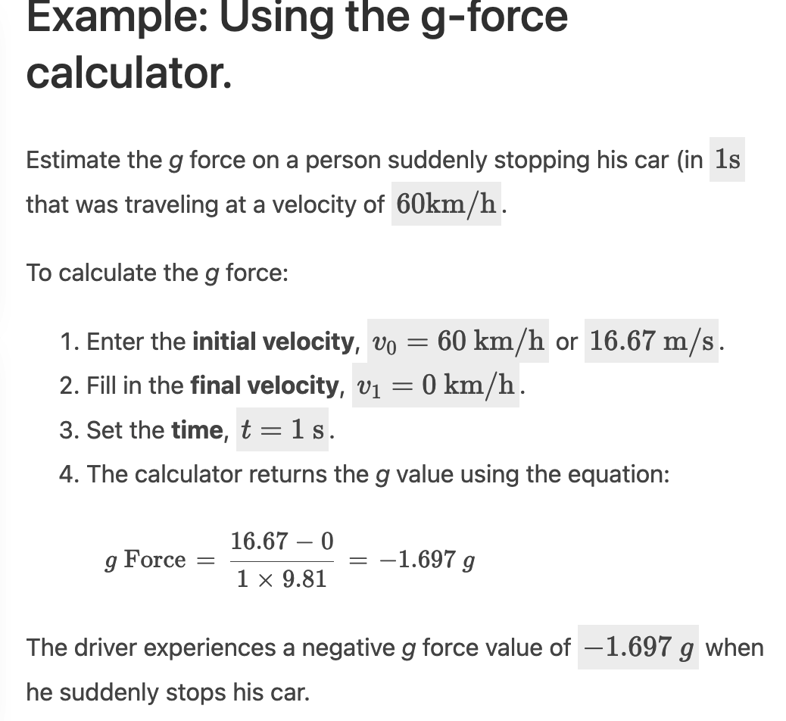

参考资料
1. https://github.com/micahpearlman/ZeroGPSLapTimer/blob/master/ZeroGPSLapTimer/arduino/gps_configure/gps_configure.ino
neogps 发送指令 参考
2. https://github.com/JimEli/gps_lap_timer
   https://github.com/JimEli/gps_lap_timer/blob/master/utility.h gps 工具内 线段相交 交点 终点线
3. https://github.com/gotzl/gps-tracker/blob/master/tracker/gps_tracker.hpp gps 终点偏移量另外一个算法 
4. https://create.arduino.cc/projecthub/guitar/gps-tacho-g-force-meter-accelerometer-1ea839 一个G值 计算参考 应该是sqrt(x2+y2+z2) 的方式

过终点算法
https://github.com/rgmorales/MiniLapTimer/blob/master/LapTimerMini.ino
https://github.com/tongo/OpenLapTimer/blob/master/Track.cpp
https://github.com/JimEli/gps_lap_timer/blob/master/utility.h

理论知识
1. https://www.datamc.org/data-acquisition/g-forces-and-acceleration/introduction-to-g-forces-and-acceleration/ datamc G值介绍
2. https://www.omnicalculator.com/physics/g-force#how-to-calculate-g-force G值计算公式

3. https://science.howstuffworks.com/science-vs-myth/everyday-myths/question633.htm 如何计算G值
4. https://convert-units.info/acceleration/g-force/0.319 G值转换到各单位计算器
 

电路知识
1. https://www.instructables.com/Arduino-Microcontroller-Self-Power-Off/ 开关电路
2. https://circuitjournal.com/arduino-auto-power-off 开关电路2 多了几个电阻

电阻色环查看器
https://www.digikey.sg/zh/resources/conversion-calculators/conversion-calculator-resistor-color-code

竞品
http://www.videovbox.cn/pc/productDetail11.html?index=10 vbox
https://www.vboxmotorsport.co.uk/index.php/us/ vbox
https://www.speedangle.com/ sa
http://www.gps-laptimer.de/ harry's laptimer
http://www.gps-laptimer.com/Add-ons3/Add-ons4.xml 全球赛道名称 harry's laptimer

https://www.aimshop.com/pages/search-results-page?q=mychron&gclid=Cj0KCQjwxb2XBhDBARIsAOjDZ37a54brmM6xeQKC6Nkv3DFpf5AOsvyC-N1mGojJ6K3r6IVJ3io9Nf8aAu1rEALw_wcB
https://www.alfano.com/en/

Unipro Unigo 7006 GPS Kit 1

ublox 指令
https://forum.arduino.cc/t/neo-6m-gps-shield-update-faster-than-1hz/452414/5
const unsigned char UBLOX_INIT[] PROGMEM = {
 // Rate (pick one)
//  0xB5,0x62,0x06,0x08,0x06,0x00,0x64,0x00,0x01,0x00,0x01,0x00,0x7A,0x12, //(10Hz)
 0xB5,0x62,0x06,0x08,0x06,0x00,0xC8,0x00,0x01,0x00,0x01,0x00,0xDE,0x6A, //(5Hz)
// 0xB5,0x62,0x06,0x08,0x06,0x00,0xE8,0x03,0x01,0x00,0x01,0x00,0x01,0x39, //(1Hz)
  // Disable specific NMEA sentences
 0xB5,0x62,0x06,0x01,0x08,0x00,0xF0,0x00,0x00,0x00,0x00,0x00,0x00,0x01,0x00,0x24, // GxGGA off
 //0xB5,0x62,0x06,0x01,0x08,0x00,0xF0,0x01,0x00,0x00,0x00,0x00,0x00,0x01,0x01,0x2B, // GxGLL off
 0xB5,0x62,0x06,0x01,0x08,0x00,0xF0,0x02,0x00,0x00,0x00,0x00,0x00,0x01,0x02,0x32, // GxGSA off
 0xB5,0x62,0x06,0x01,0x08,0x00,0xF0,0x03,0x00,0x00,0x00,0x00,0x00,0x01,0x03,0x39, // GxGSV off
 0xB5,0x62,0x06,0x01,0x08,0x00,0xF0,0x04,0x00,0x00,0x00,0x00,0x00,0x01,0x04,0x40, // GxRMC off
 0xB5,0x62,0x06,0x01,0x08,0x00,0xF0,0x05,0x00,0x00,0x00,0x00,0x00,0x01,0x05,0x47 // GxVTG off
};

 esp8266.com/viewtopic.php?p=72081
#include <SoftwareSerial.h>
SoftwareSerial gpsSerial(D2, D1);

void setup()
{
   gpsSerial.begin(9600);
        Serial.begin(9600);
   configureGPS();
}
void configureGPS()
{
   
   //Disable GGA
   uint8_t GGA[] = { 0xB5, 0x62, 0x06, 0x01, 0x08, 0x00, 0xF0, 0x00, 0x00, 0x00, 0x00, 0x00, 0x00, 0x01, 0x00, 0x24 };
   sendUBX(GGA, sizeof(GGA) / sizeof(uint8_t));
   //Disable GLL
   uint8_t GLL[] = { 0xB5, 0x62, 0x06, 0x01, 0x08, 0x00, 0xF0, 0x01, 0x00, 0x00, 0x00, 0x00, 0x00, 0x01, 0x01, 0x2B };
   sendUBX(GLL, sizeof(GLL) / sizeof(uint8_t));
   //Disable GSA
   uint8_t GSA[] = { 0xB5, 0x62, 0x06, 0x01, 0x08, 0x00, 0xF0, 0x02, 0x00, 0x00, 0x00, 0x00, 0x00, 0x01, 0x02, 0x32 };
   sendUBX(GSA, sizeof(GSA) / sizeof(uint8_t));
   //Disable GSV
   uint8_t GSV[] = { 0xB5, 0x62, 0x06, 0x01, 0x08, 0x00, 0xF0, 0x03, 0x00, 0x00, 0x00, 0x00, 0x00, 0x01, 0x03, 0x39 };
   sendUBX(GSV, sizeof(GSV) / sizeof(uint8_t));
   //Disable VTG
   uint8_t VTG[] = { 0xB5, 0x62, 0x06, 0x01, 0x08, 0x00, 0xF0, 0x05, 0x00, 0x00, 0x00, 0x00, 0x00, 0x01, 0x05, 0x47 };
   sendUBX(VTG, sizeof(VTG) / sizeof(uint8_t));
   /*uint8_t rate[] = { 0xB5, 0x62, 0x06, 0x08, 0x06, 0x00, 0xC8, 0x00, 0x01, 0x00, 0x01, 0x00, 0xDE, 0x6A };
   sendUBX(rate, sizeof(rate) / sizeof(uint8_t));*/
   //setGPS1Hz();

}
void sendUBX(uint8_t *MSG, uint8_t len) {
   gpsSerial.flush();
   gpsSerial.write(0xFF);
   delay(200);
   for (int i = 0; i<len; i++) {
      gpsSerial.write(MSG[i]);
   }
}

https://forum.arduino.cc/t/neo-gps-m6-changing-baud-rate/940094/7
tools

http://dronin.org/doxygen/flight/html/ubx__cfg_8c_source.html
const char * msg_2400 = "$PUBX,41,1,0007,0001,2400,0*1B\r\n";
  533     const char * msg_4800 = "$PUBX,41,1,0007,0001,4800,0*11\r\n";
  534     const char * msg_9600 = "$PUBX,41,1,0007,0001,9600,0*12\r\n";
  535     const char * msg_19200 = "$PUBX,41,1,0007,0001,19200,0*27\r\n";
  536     const char * msg_38400 = "$PUBX,41,1,0007,0001,38400,0*22\r\n";
  537     const char * msg_57600 = "$PUBX,41,1,0007,0001,57600,0*29\r\n";
  538     const char * msg_115200 = "$PUBX,41,1,0007,0001,115200,0*1A\r\n";
  539     const char * msg_230400 = "$PUBX,41,1,0007,0001,230400,0*18\r\n";

  d1 mini TX RX  硬件不能适应

  nodemcu D3 不能使用软串口
